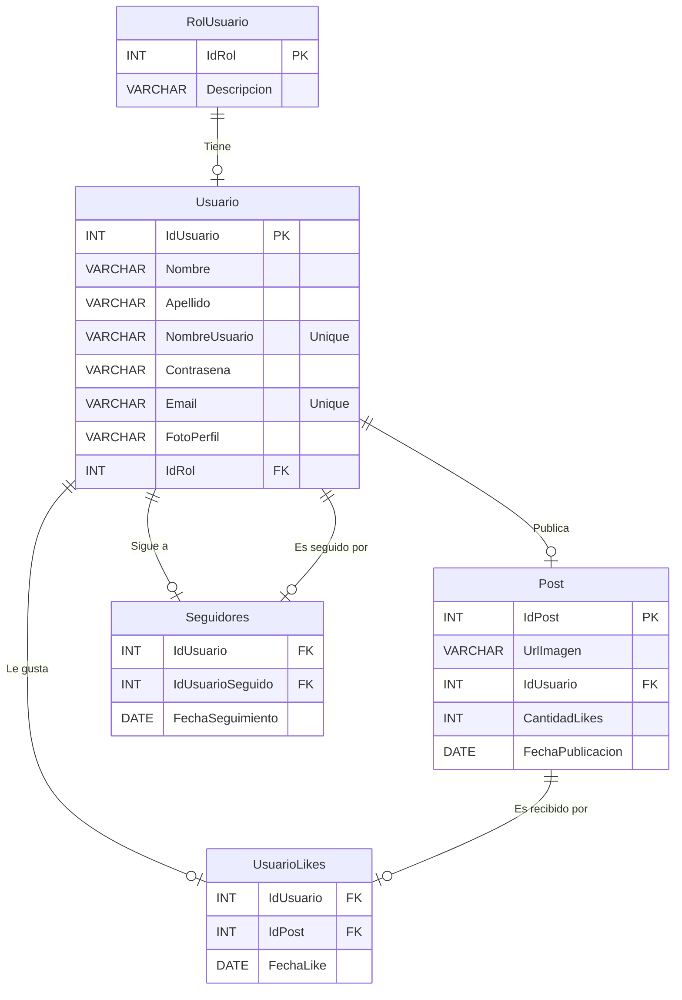

```mermaid
erDiagram
    %% Definir tablas y atributos
    RolUsuario {
        INT IdRol PK 
        VARCHAR Descripcion
    }

    Usuario {
        INT IdUsuario PK 
        VARCHAR Nombre
        VARCHAR Apellido
        VARCHAR NombreUsuario "Unique"
        VARCHAR Contrasena
        VARCHAR Email "Unique"
        VARCHAR FotoPerfil
        INT IdRol FK 
    }

    Post {
        INT IdPost PK 
        VARCHAR UrlImagen
        INT IdUsuario FK 
        INT CantidadLikes
        DATE FechaPublicacion
    }

    UsuarioLikes {
        INT IdUsuario FK 
        INT IdPost FK 
        DATE FechaLike
    }

    Seguidores {
        INT IdUsuario FK 
        INT IdUsuarioSeguido FK 
        DATE FechaSeguimiento
    }

    %% Definir relaciones
    RolUsuario ||--o| Usuario : "Tiene"
    Usuario ||--o| Post : "Publica"
    Usuario ||--o| UsuarioLikes : "Le gusta"
    Post ||--o| UsuarioLikes : "Es recibido por"
    Usuario ||--o| Seguidores : "Sigue a"
    Usuario ||--o| Seguidores : "Es seguido por"
```